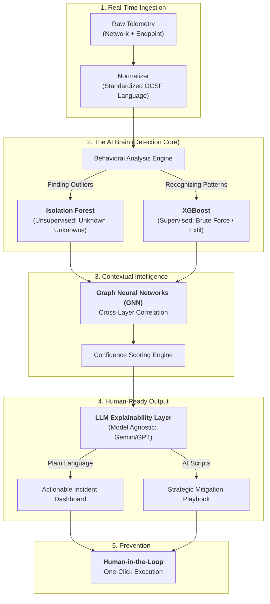

# 🛡️ NEXUS AI: Technical Architecture & Logic Reference

## 📊 1. Technical Flowchart ("The Logic Pipeline")

---

## 🧠 2. Deep-Dive Technical "Cheat Sheet"

| Concept | The "Crisp" Definition for Jury | Technical "Why" |
| :--- | :--- | :--- |
| **OCSF** | Our "Universal Translator." | Converts multi-vendor telemetry (Windows, Linux, Cisco) into a single unified schema. |
| **Isolation Forest** | Our "Anomaly Hunter." | An unsupervised algorithm that catches **"Unknown Unknowns"** by isolating outliers in fewer splits. |
| **XGBoost** | Our "Decision Maker." | A high-performance gradient boosting algorithm used for multi-class classification of known threats. |
| **GNN Correlation** | The "Dot-Connector." | Uses Graph Neural Networks to map the relationship between suspicious events across different data layers. |
| **Stream Processing** | Real-Time Engine. | Processes live data packets instantly without waiting for slow database write/read cycles. |
| **Model Agnostic** | Flexible Intelligence. | Architecture allows hot-swapping any LLM (Gemini, Claude, GPT) depending on the desired privacy level. |

---

## ❓ 3. Technical Q&A (Clear Answers for Mentors)

**Q: "You mentioned using 'Unknown Unknowns'—how does that actually work?"**
*   **A:** "Traditional systems only hunt for known bad faces. Our **Unsupervised Isolation Forest** learns the unique 'vibe' of your network and flags anything that breaks that pattern—catching brand new attacks before they are even documented by the industry."

**Q: "Why is Cross-Layer Correlation better than normal alerts?"**
*   **A:** "A single network spike is often just a false alarm. But when our **GNN** sees that spike AND a parallel unauthorized login on a laptop, it proves it's a real attack. This drastic reduction in noise solves the **Alert Fatigue** crisis for SOC analysts."

**Q: "How does the AI specifically help with Prevention?"**
*   **A:** "The AI doesn't just find the bug; it builds the cure. It instantly generates a **Strategic Mitigation Playbook** (scripts and steps) tailored to that specific attack. The human analyst simply reviews and clicks to execute, stopping the threat in seconds."

---

## ⚡ 4. Advanced Concept: Human-in-the-Loop (HITL)
> *"Nexus AI does the automated heavy lifting of detection and strategy, but the human remains the 'Senior Officer' who gives the final command. This is critical for enterprise security where a mistake in 'locking out' a server could cost millions."*
