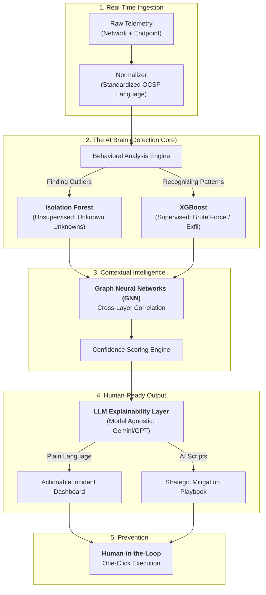

# 🛡️ NEXUS AI: Master Pitch & Technical Reference Sheet

## ⏱️ PART 1: The 60-Second Pitch (The "Hook")
*(Pace yourself: Pause for effect after bolded keywords)*

"Hello judges, we are team Nexus, and this is Nexus AI. 

Right now, enterprise security teams are drowning in raw data, suffering from massive **alert fatigue**. On top of that, traditional rule-based firewalls have a critical blind spot for **zero-day threats** because they only catch attacks they’ve seen before.

Nexus AI changes this. We built an **XDR** threat detection engine that ingests logs across both networks and endpoints. By utilizing **cross-layer correlation**, our behavioral AI connects the dots between different anomalies to confidently detect true attacks and filter out the noise.

But we don't just flash a red warning light. Our engine translates complex telemetry into **actionable intelligence**. Using a **Human-in-the-Loop** approach, the AI instantly generates a step-by-step mitigation playbook, but allows the human SOC analyst to execute the prevention with a single click. 

Thank you."

---

## 📊 PART 2: Technical Flowchart ("The Brain")

---

## 🧠 PART 3: The Technical "Cheat Sheet"

| Concept | The "Crisp" Definition for Jury |
| :--- | :--- |
| **OCSF** | Our "Universal Translator." It makes different security devices speak the same standardized industry language. |
| **Isolation Forest** | Our "Anomaly Hunter." It catches **"Unknown Unknowns"** (Zero-Day threats) by isolating weird behavior instead of matching old rules. |
| **XGBoost** | Our "Decision Maker." A classification algorithm that categorizes known attacks (like Brute Force) with high speed and 99% accuracy. |
| **Cross-Layer Correlation** | Connecting the dots. We link weird login times (Network) to weird file transfers (Endpoint) to prove an attack is real. |
| **Stream Processing** | Analyzing the data while it’s "moving" (real-time) instead of saving it and looking at it later (reactive). |
| **Model Agnostic** | We can swap LLMs (Gemini, Claude, GPT-4) or use local private models depending on client security requirements. |

---

## ❓ PART 4: Likely Mentor Q&A

**Q: "You mentioned using 'Unknown Unknowns'—how does that actually work?"**
*   **A:** "Traditional systems look for 'Wanted Posters' of bad guys. Our Unsupervised Learning learns the 'Normal' rhythm of the company. If it sees something that isn't normal, it catches the threat—even if it's a brand new attack the world has never seen before."

**Q: "Why don't you let the AI prevent attacks automatically?"**
*   **A:** "We use a **Human-in-the-Loop** model. Fully autonomous AI can be dangerous if it makes a mistake and blocks a CEO. We empower the analyst with an AI-generated **Playbook**, and they provide the final green light to execute the prevention."

**Q: "How will you realistically build this in 36 hours?"**
*   **A:** "We are not building a whole company; we are building a proof-of-concept **XDR pipeline**. We’ve focused on the ingestion of two critical log layers (Network and Endpoint) and optimized our detection logic purely for the most common enterprise threats."

---

## 💡 PART 5: Impact Keywords for Your Pitch
*   **Alert Fatigue** (The problem we solve)
*   **Zero-Day Threats** (What traditional systems miss)
*   **Human-in-the-Loop** (Our safety mechanism)
*   **Actionable Intelligence** (Not just data, but instructions)
*   **Cyber-Resilience** (Our ultimate goal for the client)
