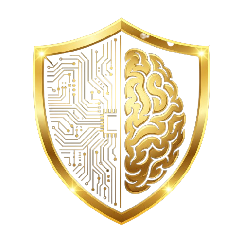
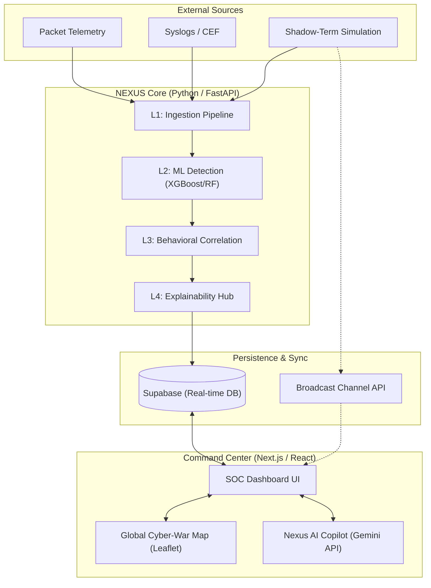

<div align="center">
  
  <h1>NEXUS.AI: NEURAL COMMAND CENTER</h1>
</div>

<p align="center">
  
  
  
  
  
  
</p>

---

## 🛡️ Overview

**NEXUS.AI** is a premium, AI-driven Security Operations Center (SOC) dashboard. It utilizes a sophisticated **4-Layer Neural Architecture** to ingest, detect, correlate, and explain threats in real-time. Designed with a high-end obsidian aesthetic and an interactive amber grid background, NEXUS.AI provides security analysts with an unparalleled command-and-control experience.

## 🚀 Core Features

- **4-Layer Analysis Pipeline**:
  - **L1 (Ingestion)**: High-throughput packet and log ingestion.
  - **L2 (Detection)**: ML-powered threat classification with ensemble methods.
  - **L3 (Correlation)**: Advanced behavioral fusion across multiple telemetry streams.
  - **L4 (Output)**: Explainable AI (XAI) providing actionable playbooks.
- **Nexus AI Analyst**: An integrated chat interface for real-time threat investigation.
- **Neural Threat Stream**: Live visualization of system events and anomalies.
- **Aesthetic Excellence**: Dark-mode primary UI with glassmorphic cards and animated background grids.

### 🔑 BIOMETRIC INITIALIZATION
To access the command center, operators must undergo a **Neural Biometric Sync**:
1. Enter operator credentials.
2. Click **"INITIALIZE NEURAL LINK"**.
3. The system will perform an adaptive scan, compensating for backlight and environmental noise, granting access only to authorized neural signatures.

## 🛠️ SETUP & DEPLOYMENT

### 🐍 Backend (Neural Pipeline)
1. Navigate to the root directory.
2. Install Python dependencies:
   ```bash
   pip install fastapi uvicorn opencv-python numpy
   ```
3. Initialize the neural core:
   ```bash
   python server.py
   ```

### ⚛️ Frontend (Command Center)
1. Install node dependencies:
   ```bash
   npm install
   ```
2. Configure `.env` with your Supabase credentials.
3. Launch the dashboard:
   ```bash
   npm run dev
   ```

---
<div align="center">
  <sub>SECURED BY NEXUS NEURAL ARCHITECTURE v2.0</sub>
</div>

## 🛠️ Technology Stack

| Component | Technology |
| :--- | :--- |
| **Frontend** | [Next.js 15+](https://nextjs.org), [React 19](https://react.dev) |
| **Styling** | Vanilla CSS (CSS Variables), Framer Motion |
| **Backend** | [FastAPI (Python)](https://fastapi.tiangolo.com) |
| **Data Visualization** | [Recharts](https://recharts.org) |
| **Icons** | [Lucide React](https://lucide.dev) |
| **AI Integration** | Google Gemini API (Simulated Bridge) |

## 📦 Getting Started

### 1. Backend Setup
```bash
# Navigate to the root directory
# Run the FastAPI server
python server.py
```

### 2. Frontend Setup
```bash
# Install dependencies
npm install

# Start the development server
npm run dev
```

Open [http://localhost:3000](http://localhost:3000) for the frontend and [http://localhost:8000/docs](http://localhost:8000/docs) for the API documentation.

## 🏛️ System Architecture

NEXUS AI is built on a high-synchronicity, **4-Layer Neural Pipeline**. This architecture ensures that raw security data is progressively refined into actionable forensic intelligence.

### High-Level Technical Diagram



---

### 🛡️ The 4-Layer Processing Logic
Nexus AI operates through four distinct stages of refinement:

#### 1. L1 - Ingestion & Normalization
*   **Role**: The "Nervous System." It consumes raw, messy data from Cloudflare, Cisco, AWS, and simulators.
*   **Action**: It converts these into a standard **Feature Vector** (IPs, Protocols, Byte counts) so the ML layers can process them.

#### 2. L2 - ML Detection (Ensemble)
*   **Role**: The "Pattern Brain." It uses a weighted ensemble of **XGBoost** (for rapid gradient boosting) and **Random Forest** (for behavioral categorization).
*   **Action**: It calculates an **Anomaly Probability Score** (e.g., *94% Confidence - DDoS*).

#### 3. L3 - Behavioral Fusion
*   **Role**: The "Narrative Brain." It correlates isolated alerts. 
*   **Action**: If it sees 50 small failed logins (L2) followed by a massive data export (L2), L3 fuses these into a single **"Active Brute Force Infiltration"** incident.

#### 4. L4 - Explainability Hub (XAI)
*   **Role**: The "Strategic Advisor." 
*   **Action**: It generates human-readable incident summaries and defensive playbooks (e.g., *"Block IP 192.x.x.x immediately via firewall rule #45"*) for the SOC analyst.

---

### ⚡ Technology Stack
*   **Frontend**: Next.js 15, React 19, Framer Motion (Animations), Leaflet (Mapping).
*   **Backend**: Python 3.11+, FastAPI (High-speed API), NumPy & Scikit-learn (ML Core).
*   **Real-time Infrastructure**: Supabase (PostgreSQL + Real-time engine) for alert persistence and synchronization across analyst tabs.

---
<p align="center">Built with ⚡ by Antigravity AI</p>
