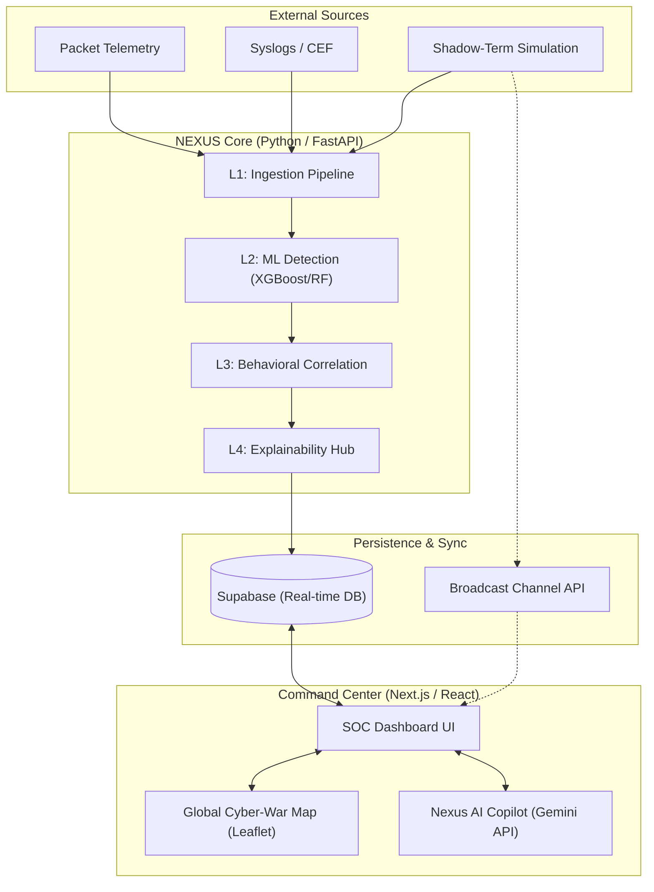

# NEXUS AI: System Architecture

NEXUS AI is built on a high-synchronicity, **4-Layer Neural Pipeline**. This architecture ensures that raw security data is progressively refined into actionable forensic intelligence.

## 🏛️ High-Level Technical Diagram

---

## 🛡️ The 4-Layer Processing Logic
Nexus AI operates through four distinct stages of refinement:

### 1. L1 - Ingestion & Normalization
*   **Role**: The "Nervous System." It consumes raw, messy data from Cloudflare, Cisco, AWS, and simulators.
*   **Action**: It converts these into a standard **Feature Vector** (IPs, Protocols, Byte counts) so the ML layers can process them.

### 2. L2 - ML Detection (Ensemble)
*   **Role**: The "Pattern Brain." It uses a weighted ensemble of **XGBoost** (for rapid gradient boosting) and **Random Forest** (for behavioral categorization).
*   **Action**: It calculates an **Anomaly Probability Score** (e.g., *94% Confidence - DDoS*).

### 3. L3 - Behavioral Fusion
*   **Role**: The "Narrative Brain." It correlates isolated alerts. 
*   **Action**: If it sees 50 small failed logins (L2) followed by a massive data export (L2), L3 fuses these into a single **"Active Brute Force Infiltration"** incident.

### 4. L4 - Explainability Hub (XAI)
*   **Role**: The "Strategic Advisor." 
*   **Action**: It generates human-readable incident summaries and defensive playbooks (e.g., *"Block IP 192.x.x.x immediately via firewall rule #45"*) for the SOC analyst.

---

## ⚡ Technology Stack
*   **Frontend**: Next.js 15, React 19, Framer Motion (Animations), Leaflet (Mapping).
*   **Backend**: Python 3.11+, FastAPI (High-speed API), NumPy & Scikit-learn (ML Core).
*   **Real-time Infrastructure**: Supabase (PostgreSQL + Real-time engine) for alert persistence and synchronization across analyst tabs.
