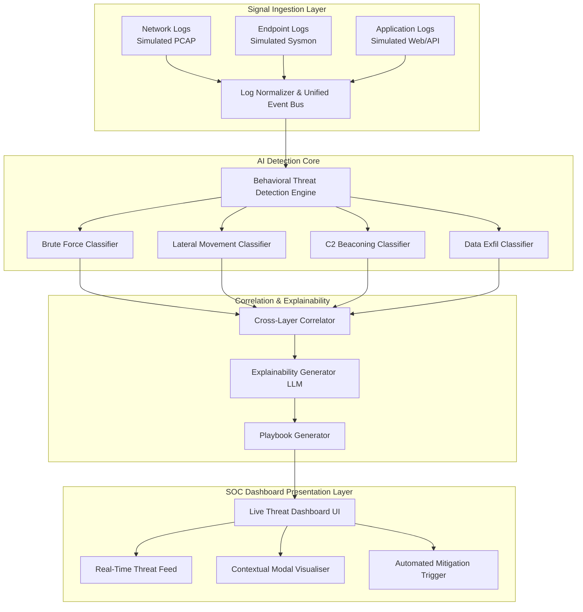

# Nexus AI: Threat Detection & Simulation Engine
### Team: Nexus
### Hackathon: Hack Malenadu '26 | Cybersecurity Track

---

## 1. Executive Summary
Organizations face advanced cyber threats that traditional, rule-based systems struggle to capture. **Nexus AI** shifts the paradigm from reactive firefighting to proactive defense by providing an AI-driven, multi-layer Threat Detection & Simulation Engine. The solution ingests signals dynamically, classifies distinct threat typologies automatically, highlights specific evidence via Explainable AI (XAI), and dynamically generates real-time prevention playbooks for Security Operations Center (SOC) personnel. 

## 2. Key Capabilities
1. **Multi-Signal Ingestion:** Unifies parsing of Network, Endpoint, and Application layers.
2. **AI Threat Classification:** Detects Brute Force, Lateral Movement, Data Exfiltration, and C2 Beaconing.
3. **Cross-Layer Correlation:** Correlates disparate event signals to filter noise and increase confidence indices natively.
4. **Context & Explainability:** Highlights exactly *why* a set of behaviors triggered a classification, mapping directly to network flow logs or suspicious payloads.
5. **Actionable Playbooks:** Dynamically generates step-by-step mitigation and containment strategies per incident framework.

## 3. Technical Architecture

## 4. Why We Chose This Design
We adopted a robust decoupling of the visualization engine from the simulated data layer. The interactive live **SOC Dashboard** is crafted meticulously with a cyberpunk-focused, modern glassmorphism UI constructed heavily using the `TypeScript/React` ecosystem (`Vite`).

This allows the UI to easily support **burst event handling (500+ EPS simulated internally)**, ensuring no system stalling during peak attack vectors or bulk telemetry ingestion flows. Our demonstration models complex alerts spanning cross-layer intersections and includes deliberate False Positives (like an internal Cloud Backup transfer mimicking an exfiltration sequence).
